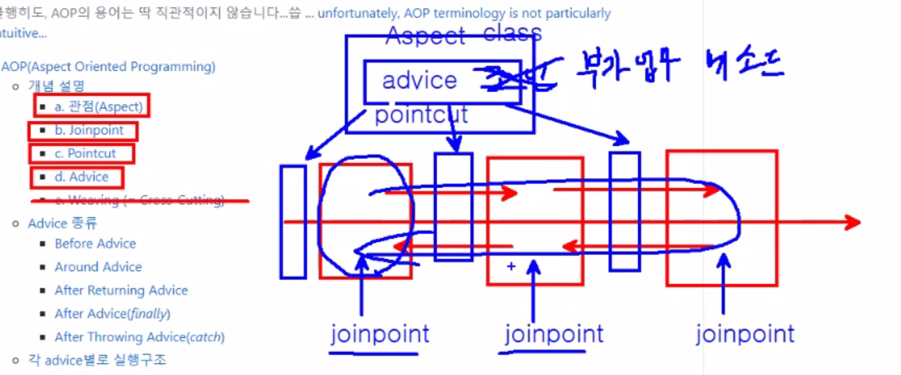

# AOP(Aspect Oriented Programming)

> **관점 지향 프로그래밍**
>
> **관심사의 분리**(Seperation of Concerns)해서 필요한 주업무에 모듈형식으로 삽입해 실행함.

[Spring API](https://docs.spring.io/spring/docs/4.2.x/spring-framework-reference/html/aop.html)

> 불행히도, AOP의 용어는 딱 직관적이지 않습니다...씁 [... unfortunately, AOP terminology is not particularly intuitive...](https://docs.spring.io/spring/docs/4.2.x/spring-framework-reference/html/aop.html#aop-introduction-defn)

- [AOP(Aspect Oriented Programming)](#AOPAspect-Oriented-Programming)
  - [개념 설명](#%EA%B0%9C%EB%85%90-%EC%84%A4%EB%AA%85) 특히 abcd까지는 잘 보자
    - [a. 관점(Aspect)](#a-%EA%B4%80%EC%A0%90Aspect) 단위:JavaClass로 aspect = pointcut + advice
    - [b. Joinpoint](#b-Joinpoint) 주 업무로직의 메서드
    - [c. Pointcut](#c-Pointcut) advice를 어디에 끼워 넣을까 정해주는게 pointcut
    - [d. Advice](#d-Advice) 부가업무(메서드에 작성)
    - [e. Weaving (= Cross-Cutting)](#e-Weaving--Cross-Cutting)
    - 강사님 요약 
  - [Advice 종류](#Advice-%EC%A2%85%EB%A5%98)
    - [Before Advice](#Before-Advice)
    - [Around Advice](#Around-Advice)
    - [After Returning Advice](#After-Returning-Advice)
    - [After Advice(_finally_)](#After-Advicefinally)
    - [After Throwing Advice(_catch_)](#After-Throwing-Advicecatch)
  - [각 advice별로 실행구조](#%EA%B0%81-advice%EB%B3%84%EB%A1%9C-%EC%8B%A4%ED%96%89%EA%B5%AC%EC%A1%B0)
  - [선언식에서의 표현](#%EC%84%A0%EC%96%B8%EC%8B%9D%EC%97%90%EC%84%9C%EC%9D%98-%ED%91%9C%ED%98%84)
  - [Pointcut 선언하기](#Pointcut-%EC%84%A0%EC%96%B8%ED%95%98%EA%B8%B0)

## 개념 설명

AOP는 OOP를 대신하는 새로운 개념이 아니라, OOP를 더욱 OOP답게 사용할 수 있도록 도와주는 개념이다.

- 객체를 재사용함으로써 개발자들은 반복되는 코드를 많이 줄였지만, 매 요청마다 로그, 권한 체크, 인증, 예외 처리 등 필수요소는 반복될 수 밖에 없음
- AOP를 통해, 비지니스 로직(주업무)과 공통 모듈(보조업무)로 구분한 후에 비지니스로직 코드외부에서 **필요한 시점에 공통모듈을 삽입하여 실행되게함**.
- 기존 프로그래밍에서 각 객체별로 처리했던 것을 AOP에서는 각 관점별로 외부에서 접근해 처리하게됨.
- 즉 개발자는 계정, 게시판, 계좌이체와 같은 주업무 기능과, 공통적인 관심을 처리하는 보조업무기능을 각각 모듈로써 분리/개발한 후, 필요한 시점에 자동으로 소스코드가 삽입되도록 함.

### a. 관점(Aspect)

구현하고자 하는 횡단 관심사의 기능. 클래스단위
한개 이상의 Pointcut과 Advice의 조합으로 만들어진다.

- 선언적AOP에서 사용하는 advisor는 하나의 advice(부가기능)와 하나의 pointcut(advice를 어디에 적용할지 결정)의 조합을 가리킴.

### b. Joinpoint

관점(Aspect)를 삽입하여 Advice가 적용될 수 있는 위치로써, 주업무 처리 메소드를 가리킨다.
횡단 관심 모듈의 기능이 삽입되어 동작할 수 있는 실행 가능한 특정위치

대표적인 조인포인트

- 메소드가 호출되는 부분 또는 리턴되는 부분
- 인스턴스가 만들어지는 지점
- 예외가 던져지는 지점
- 클래스가 초기화 되는 곳

각각의 조인포인트들은 그 안에 횡단 관심기능(advice)이 AOP에 의해 동작할 수 있는 후보지가 되는 것이다.

### c. Pointcut

어느 클래스의 어떤 메소드, 어느 joinpoint를 사용할것인가?
**joinpoint선정룰과 같은 개념**
AOP에서는 포인트컷을 수행할 수 있는 다양한 접근 방법을 제공하는데, AspectJ에서는 와일드카드를 이용한 메쏘드 시그니처를 사용한다.
`execution(modifiers-pattern? ret-type-pattern declaring-type-pattern?name-pattern(param-pattern) throws-pattern?)`

[Pointcuts Expression API](https://docs.spring.io/spring/docs/4.2.x/spring-framework-reference/html/aop.html#aop-pointcuts-examples)

접근제한자가 public 이고, 리턴타입 상관없고, com.test.memo.Memo클래스의 login\_으로 시작하는 모든 메소드
(파라미터에 상관없음)
로그인 체크가 필요한 메소드는 이와같이 동일한 접두어를 써서 구분 할 수 있으므로, 메소드 명명시 주의할 것.

### d. Advice

각 조인포인트에 삽입되어져 동작할 수 있는 코드
주로 메소드 단위로 구성된 어드바이스는 포인트컷에 의해 결정된 모듈의 조인포인트에서 호출되어 사용됨.
일반적으로 독립적인 클래스 등으로 구현된 횡단 관심 모듈을 조인포인트의 정보를 참조해서 이용하는 방식으로 작성된다.

Advice는 Joinpoint와 결합하여 동작하는 시점에 따라 5개로 구분된다.

1. Before Advice : Joinpoint 전에 실행
2. Around Advice : Joinpoint 앞과 뒤에서 실행
3. After Returning Advice : Joinpoint 메소드가 리턴될시 실행. Return된 object에 접근가능
4. After Advice : Joinpoint후에 무조건 실행됨(예외발생시에도 실행. finally와 유사함.)
5. After Throwing Advice : Jointpoint 메소드 실행중 예외발생시 실행

### e. Weaving (= Cross-Cutting)

Pointcut에 의해서 결정된 Joinpoint에 지정된 Advice 를 삽입하는 과정.

Weaving 은 AOP가 기존의 핵심 관심 모듈의 코드에 전혀 영향을 주지 않으면서 필요한 횡단 관심 기능을 추가할 수 있게 해주는 핵심적인 처리과정이다.

weaving하는 3가지 방법

1. 컴파일시에 Weaving하기
2. 클래스 로딩 시에 Weaving하기
3. 런타임시에 Weaving하기

## Advice 종류

> (포인트) 보조업무가 주업무와 어떤 순서로 서로 엮여서 실행되는지 이해하는 것이 중요함.

### Before Advice

- 조인포인트에서 메소드가 실행되기전에 실행되는 advice

### Around Advice

- 위치가 자유롭다.
- 조인포인트에서 메소드의 실행 이전, 이후, 예외발생등 모든 시점에서 실행되는 advice

### After Returning Advice

> 주업무에서 생성된 데이터(결과값 등)를 보조업무에 넘겨서 연계해야 하는 경우에 사용되는 Advice 이다.

- 조인포인트에서 메소드가 성공적으로 실행된 후에 실행되는 advice
- 단, Around 와 After Returning 을 동시에 사용하면 After Returning 이 반환값을 받지 못하기 때문에 **Arround 는 반드시 제거하고서 After Returning 을 적용한다.**
- Advice의 파라미터명과 XML의 returning 의 속성값가 동일해야 한다.
  
  

### After Advice(_finally_)

- 조인포인트에서 메소드의 실행결과에 상관없이 무조건 실행되는 advice(자바의 finally와 비슷한 역할임)

### After Throwing Advice(_catch_)

- 예외가 발생하였을 경우 실행되는 advice(자바의 catch 와 비슷한 역할임)

## 각 advice별로 실행구조

    	   Around Advice                Before Advice                After Advice           After Returning Advice       After Throwing Advice
    	------------------------------------------------------------------------------------------------------------------------------------------------
    	  	  ▼                         ▼                             ▼                             ▼                                 ▼
    	Cross-cutting Concern     Cross-cutting Concern        Primary Concern			Primary Concern              Primary Concern
    	   Primary Concern             Primary Concern       Cross-cutting Concern			▽ (결과값 전달)                ▽ (예외객체 전달)
    	Cross-cutting Concern                ▼                             ▼                    Cross-cutting Concern       Cross-cutting Concern
    	          ▼                                                                                      ▼                                ▼

## 선언식에서의 표현

`<aop:config>`태그 몸체에서 작성하고, advisor태그 혹은 aspect태그로 작성할 수 있음

1. `<aop:advisor> : 1 advice + 1 pointcut`

- pointcut : 상기표현식으로 joinpoint를 선정함.
- pointcut-ref : 선언된 pointcut을 이름으로 참조함.

      <aop:config>
      	<aop:advisor
      		pointcut="com.xyz.someapp.SystemArchitecture.businessService()"
      		advice-ref="some-advice"/>
      </aop:config>

2. `<aop:aspect> : multiple pointcut + multiple advice`

- <aop:aspect>는 등록된 특정 Aspect빈(클래스)을 참조함.(@Aspect 어노테이션 선언과 동일함.)

      <aop:config>
      	<aop:aspect id="loggerAspect" ref="loggerAspect">
      		<aop:pointcut expression="execution(* com.kh.spring.memo..*(..))" id="pc"/>
      		<aop:around method="aroundAdvice" pointcut-ref="pc"/>
      		<aop:before method="beforeAdvice" pointcut-ref="pc"/>
      	</aop:aspect>
      </aop:config>

3.  `<aop:pointcut> : pointcut 표현식 이용`

        <aop:config>
        	<aop:pointcut id="businessService"
        		expression="execution(* com.xyz.myapp.service.*.*(..))"/>
        </aop:config>

## Pointcut 선언하기

Pointcut은 Aspectj를 통해 와일드카드를 이용한 다음 표현식을 지원함.(&&, ||, !(부정)를 지원함.)

1.  execution pointcut designator
    `execution(modifiers-pattern? ret-type-pattern declaring-type-pattern?name-pattern(param-pattern) throws-pattern?)`

        @Pointcut("execution(public * *(..))")
        private void anyPublicOperation() {}

2.  within pointcut designator

    @Pointcut("within(com.xyz.someapp.trading..\*)")
    private void inTrading() {}

3.  name pointcut designator(다른 pointcut을 이름으로 참조함)

    @Pointcut("anyPublicOperation() && inTrading()")
    private void tradingOperation() {}

return-type-pattern, name-pattern, parameter-patter을 제외하고는 모두 optional임.

- return-type이 \*이면, 모든 타입이 해당

[Spring API : pointcut 표현식예제](https://docs.spring.io/spring/docs/4.2.x/spring-framework-reference/html/aop.html#aop-pointcuts-examples)

[Introduction to Pointcut Expressions in Spring](https://www.baeldung.com/spring-aop-pointcut-tutorial)
